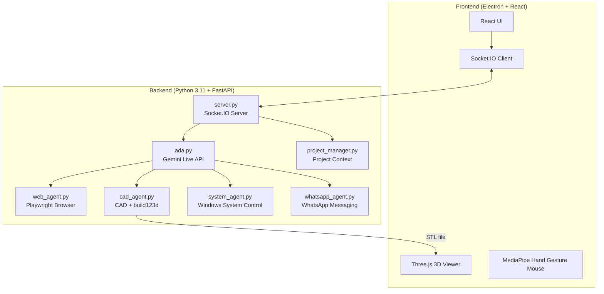

# HAPPY V2 - Ai powered Desktop Assistant


Happy V2 is a sophisticated AI assistant designed for multimodal interaction. It combines Google's Gemini 2.5 Native Audio with computer vision, gesture-based mouse control, Windows system automation, and 3D CAD generation in an Electron desktop application.

---
## 🎬 Demo

[](./Demo-Happy.mp4)
---
---
## 🌟 Capabilities at a Glance

| Feature | Description | Technology |
|---------|-------------|------------|
| **🗣️ Low-Latency Voice** | Real-time conversation with interrupt handling | Gemini 2.5 Native Audio |
| **🧊 Parametric CAD** | Editable 3D model generation from voice prompts | `build123d` → STL |
| **🖥️ System Control** | Volume, brightness, Wi-Fi, Bluetooth, apps, screenshots & more | PowerShell + WMI + pycaw |
| **💬 WhatsApp Messaging** | Send WhatsApp messages hands-free via voice | pyautogui + pyperclip |
| **🖐️ Hand Gesture Mouse** | Control your cursor and click using hand gestures | MediaPipe Hand Tracking |
| **🌐 Web Agent** | Autonomous browser automation & search | Playwright + Chromium |
| **📁 Project Memory** | Persistent context across sessions | File-based JSON storage |

---

### 🖥️ System Control Details

HAPPY can control your Windows system entirely through voice commands:

| Category | Commands |
|----------|----------|
| **Volume** | Set volume %, mute/unmute, step up/down |
| **Brightness** | Set brightness %, step up/down |
| **Wi-Fi** | Turn Wi-Fi on/off, check connection status |
| **Bluetooth** | Turn Bluetooth on/off |
| **Applications** | Open any app by name, close running apps |
| **Power** | Lock, sleep, shutdown, restart, hibernate |
| **System Info** | Battery %, CPU/RAM usage, storage, IP address |
| **Utilities** | Take screenshot, open folders, Google Search, clipboard management |
| **Browser Search** | Instantly search Google from a voice prompt |

---

### 💬 WhatsApp Messaging Details

HAPPY can send WhatsApp messages using your installed Windows WhatsApp desktop app — no browser scraping, no web API:

- **Voice-driven**: Just say "Send a WhatsApp message to [Name] saying [Message]"
- **Confirmation step**: HAPPY asks you to confirm before sending
- **Clipboard-based input**: Avoids keyboard layout issues by pasting text directly
- **Auto-launch**: Starts WhatsApp automatically if it's not already open

---

### 🖐️ Hand Gesture Mouse Control Details

HAPPY's "Minority Report" interface turns your webcam into a hands-free mouse — no physical mouse needed:

| Gesture | Action |
|---------|--------|
| ☝️ **Point** | Move the cursor — index fingertip maps to screen position |
| 🤏 **Pinch** | Click — bring index finger and thumb together |
| ✊ **Close Fist** | Grab and drag a UI window |
| ✋ **Open Palm** | Release a dragged window |

**Additional details:**
- Smooth cursor movement via lerp interpolation (0.2 factor)
- Snap-to-button: cursor magnetically snaps to nearby buttons/inputs within 50px
- Adjustable sensitivity (default 2×) and optional camera flip in Settings
- Cyan hand skeleton overlay drawn on the video feed for visual feedback
- Enable/disable via voice command: *"Turn on hand gesture control"*

> **Tip**: Enable the video feed window to see the hand tracking skeleton overlay.

---

## 🏗️ Architecture Overview



---

## ⚡ TL;DR Quick Start (Experienced Developers)

<details>
<summary>Click to expand quick setup commands</summary>

```bash
# 1. Clone and enter
git clone https://github.com/nazirlouis/happy_v2.git && cd happy_v2

# 2. Create Python environment (Python 3.11)
conda create -n happy_v2 python=3.11 -y && conda activate happy_v2
brew install portaudio  # macOS only (for PyAudio)
pip install -r requirements.txt
playwright install chromium

# 3. Setup frontend
npm install

# 4. Create .env file
echo "GEMINI_API_KEY=your_key_here" > .env

# 5. Run!
conda activate happy_v2 && npm run dev
```

</details>

---

## 🛠️ Installation Requirements

### 🆕 Absolute Beginner Setup (Start Here)
If you have never coded before, follow these steps first!

**Step 1: Install Visual Studio Code (The Editor)**
- Download and install [VS Code](https://code.visualstudio.com/). This is where you will write code and run commands.

**Step 2: Install Anaconda (The Manager)**
- Download [Miniconda](https://docs.conda.io/en/latest/miniconda.html) (a lightweight version of Anaconda).
- This tool allows us to create isolated "playgrounds" (environments) for our code so different projects don't break each other.
- **Windows Users**: During install, check "Add Anaconda to my PATH environment variable" (even if it says not recommended, it makes things easier for beginners).

**Step 3: Install Git (The Downloader)**
- **Windows**: Download [Git for Windows](https://git-scm.com/download/win).
- **Mac**: Open the "Terminal" app (Cmd+Space, type Terminal) and type `git`. If not installed, it will ask to install developer tools—say yes.

**Step 4: Get the Code**
1. Open your terminal (or Command Prompt on Windows).
2. Type this command and hit Enter:
   ```bash
   git clone https://github.com/nazirlouis/happy_v2.git
   ```
3. This creates a folder named `happy_v2`.

**Step 5: Open in VS Code**
1. Open VS Code.
2. Go to **File > Open Folder**.
3. Select the `happy_v2` folder you just downloaded.
4. Open the internal terminal: Press `Ctrl + ~` (tilde) or go to **Terminal > New Terminal**.

---

### ⚠️ Technical Prerequisites
Once you have the basics above, continue here.

### 1. System Dependencies

**MacOS:**
```bash
# Audio Input/Output support (PyAudio)
brew install portaudio
```

**Windows:**
- No additional system dependencies required!

### 2. Python Environment
Create a single Python 3.11 environment:

```bash
conda create -n happy_v2 python=3.11
conda activate happy_v2

# Install all dependencies
pip install -r requirements.txt

# Install Playwright browsers
playwright install chromium
```

### 3. Frontend Setup
Requires **Node.js 18+** and **npm**. Download from [nodejs.org](https://nodejs.org/) if not installed.

```bash
# Verify Node is installed
node --version  # Should show v18.x or higher

# Install frontend dependencies
npm install
```

---

## ⚙️ Configuration (`settings.json`)

The system creates a `settings.json` file on first run. You can modify this to change behavior:

| Key | Type | Description |
| :--- | :--- | :--- |
| `tool_permissions` | `obj` | Controls manual approval for specific tools. |
| `tool_permissions.generate_cad` | `bool` | If `true`, requires you to click "Confirm" on the UI before generating CAD. |
| `tool_permissions.run_web_agent` | `bool` | If `true`, requires confirmation before opening the browser agent. |
| `tool_permissions.write_file` | `bool` | **Critical**: Requires confirmation before the AI writes code/files to disk. |

---

### 4. 🔑 Gemini API Key Setup
HAPPY uses Google's Gemini API for voice and intelligence. You need a free API key.

1. Go to [Google AI Studio](https://aistudio.google.com/app/apikey).
2. Sign in with your Google account.
3. Click **"Create API Key"** and copy the generated key.
4. Create a file named `.env` in the `happy_v2` folder (same level as `README.md`).
5. Add this line to the file:
   ```
   GEMINI_API_KEY=your_api_key_here
   ```
6. Replace `your_api_key_here` with the key you copied.

> **Note**: Keep this key private! Never commit your `.env` file to Git.

---

## 🚀 Running HAPPY V2

You have two options to run the app. Ensure your `happy_v2` conda environment is active!

### Option 1: The "Easy" Way (Single Terminal)
The app is smart enough to start the backend for you.
1. Open your terminal in the `happy_v2` folder.
2. Activate your environment: `conda activate happy_v2`
3. Run:
   ```bash
   npm run dev
   ```
4. The backend will start automatically in the background.

### Option 2: The "Developer" Way (Two Terminals)
Use this if you want to see the Python logs (recommended for debugging).

**Terminal 1 (Backend):**
```bash
conda activate happy_v2
python backend/server.py
```

**Terminal 2 (Frontend):**
```bash
# Environment doesn't matter here, but keep it simple
npm run dev
```

---

## ✅ First Flight Checklist (Things to Test)

1. **Voice Check**: Say "Hello Happy". She should respond.
2. **Gesture Check**: Enable the camera, raise your hand, and move your index finger — the cursor should follow.
3. **System Control**: Say "Set volume to 50%" or "Turn on Bluetooth".
4. **WhatsApp**: Say "Send a WhatsApp message to [Contact] saying [Message]".
5. **CAD Check**: Open the CAD window and say "Create a cube". Watch the logs.
6. **Web Check**: Open the Browser window and say "Search for the latest AI news".

---

## ▶️ Commands & Tools Reference

### 🗣️ Voice Commands
- "Switch project to [Name]"
- "Create a new project called [Name]"
- "Pause audio" / "Stop audio"
- "Turn on hand gesture control"
- "Turn off the camera"

### 🖥️ System Control
- "Set volume to 40%"
- "Mute / Unmute"
- "Set brightness to 70%"
- "Turn on / off Wi-Fi"
- "Turn on / off Bluetooth"
- "Open [App Name]" / "Close [App Name]"
- "Lock the computer" / "Shut down" / "Restart" / "Sleep"
- "Take a screenshot"
- "What's my battery level?" / "How much RAM am I using?"
- "Search Google for [query]"
- "Copy [text] to clipboard"

### 💬 WhatsApp
- **Send**: "Send a WhatsApp message to [Contact Name] saying [Message]"
- HAPPY will confirm the message before sending.

### 🧊 3D CAD
- **Prompt**: "Create a 3D model of a hex bolt."
- **Iterate**: "Make the head thinner." (Requires previous context)
- **Files**: Saves to `projects/[ProjectName]/output.stl`.

### 🌐 Web Agent
- **Prompt**: "Go to Amazon and find a USB-C cable under $10."
- **Note**: The agent will auto-scroll, click, and type. Do not interfere with the browser window while it runs.

---

## ❓ Troubleshooting FAQ

### Camera not working / Permission denied (Mac)
**Symptoms**: Error about camera access, or video feed shows black.

**Solution**:
1. Go to **System Preferences > Privacy & Security > Camera**.
2. Ensure your terminal app (e.g., Terminal, iTerm, VS Code) has camera access enabled.
3. Restart the app after granting permission.

---

### `GEMINI_API_KEY` not found / Authentication Error
**Symptoms**: Backend crashes on startup with "API key not found".

**Solution**:
1. Make sure your `.env` file is in the root `happy_v2` folder (not inside `backend/`).
2. Verify the format is exactly: `GEMINI_API_KEY=your_key` (no quotes, no spaces).
3. Restart the backend after editing the file.

---

### WebSocket connection errors (1011)
**Symptoms**: `websockets.exceptions.ConnectionClosedError: 1011 (internal error)`.

**Solution**:
This is a server-side issue from the Gemini API. Simply reconnect by clicking the connect button or saying "Hello Happy" again. If it persists, check your internet connection or try again later.

---

### System control commands not working (Windows)
**Symptoms**: Brightness or Bluetooth commands fail.

**Solution**:
1. Run the app (or the backend terminal) **as Administrator** for WMI brightness control.
2. Ensure your monitor supports WMI brightness control (most laptop displays do; external monitors may not).
3. For Bluetooth, confirm Windows Bluetooth service is enabled in **Device Manager**.

---

## 📸 What It Looks Like

*Coming soon! Screenshots and demo videos will be added here.*

---

## 📂 Project Structure

```
happy_v2/
├── backend/                    # Python server & AI logic
│   ├── ada.py                  # Gemini Live API integration
│   ├── server.py               # FastAPI + Socket.IO server
│   ├── system_agent.py         # Windows system control (volume, brightness, Wi-Fi, apps, etc.)
│   ├── whatsapp_agent.py       # WhatsApp desktop automation
│   ├── cad_agent.py            # CAD generation orchestrator
│   ├── web_agent.py            # Playwright browser automation
│   ├── project_manager.py      # Project context management
│   └── tools.py                # Tool definitions for Gemini
├── src/                        # React frontend
│   ├── App.jsx                 # Main application + hand gesture mouse control
│   ├── components/             # UI components
│   └── index.css               # Global styles
├── electron/                   # Electron main process
│   └── main.js                 # Window & IPC setup
├── projects/                   # User project data (auto-created)
├── .env                        # API keys (create this!)
├── requirements.txt            # Python dependencies
├── package.json                # Node.js dependencies
└── README.md                   # You are here!
```

---

## ⚠️ Known Limitations

| Limitation | Details |
|------------|---------|
| **Windows-first** | System control, WhatsApp automation, and several utilities use Windows-specific APIs. Linux/macOS support is partial. |
| **Camera Required** | Hand gesture mouse control needs a working webcam. |
| **Gemini API Quota** | Free tier has rate limits; heavy CAD iteration may hit limits. |
| **Network Dependency** | Requires internet for Gemini API (no offline mode). |
| **WhatsApp Desktop** | WhatsApp messaging requires the Windows WhatsApp desktop app to be installed. |
| **Brightness Control** | WMI brightness adjustment works on most laptops but may not work on external monitors. |

---

## 🤝 Contributing

Contributions are welcome! Here's how:

1. **Fork** the repository.
2. **Create a branch**: `git checkout -b feature/amazing-feature`
3. **Commit** your changes: `git commit -m 'Add amazing feature'`
4. **Push** to the branch: `git push origin feature/amazing-feature`
5. **Open a Pull Request** with a clear description.

### Development Tips

- Run the backend separately (`python backend/server.py`) to see Python logs.
- Use `npm run dev` without Electron during frontend development (faster reload).
- The `projects/` folder contains user data—don't commit it to Git.

---

## 🔒 Security Considerations

| Aspect | Implementation |
|--------|----------------|
| **API Keys** | Stored in `.env`, never committed to Git. |
| **Tool Confirmations** | Write/CAD/Web actions can require user approval. |
| **System Control** | One-time session authorization dialog shown on startup. |
| **No Cloud Storage** | All project data stays on your machine. |

> [!WARNING]
> Never share your `.env` file. It contains your Gemini API key.

---

## 🙏 Acknowledgments

- **[Google Gemini](https://deepmind.google/technologies/gemini/)** — Native Audio API for real-time voice
- **[build123d](https://github.com/gumyr/build123d)** — Modern parametric CAD library
- **[MediaPipe](https://developers.google.com/mediapipe)** — Hand tracking and gesture recognition
- **[Playwright](https://playwright.dev/)** — Reliable browser automation

---

## 📄 License

This project is licensed under the **MIT License** — see the [LICENSE](LICENSE) file for details.

---

<p align="center">
  <strong>Built with 🤖 by Nazir Louis</strong><br>
  <em>Bridging AI, Automation, and Gesture Control in a Single Interface</em>
</p>
